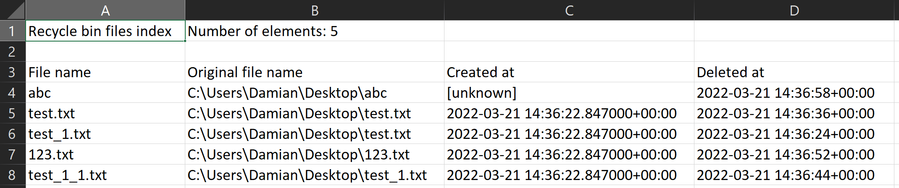

# Recycle Bin Exporter
A simple python script to export Windows recycle bin contents.

- It allows you to export files and directories from the recycle bin without deleting them from it
- It is resistant to name conflicts
- It generates a CSV file with an index of the exported files

# Requirements
- Python 3 (script was tested on version 3.10)
- Required modules: pypiwin32, winshell

```
py -m pip install pypiwin32
py -m pip install winshell
```

# Example CSV file
```
"Recycle bin files index";"Number of elements: 5"

"File name";"Original file name";"Created at";"Deleted at"
"abc";"C:\Users\Damian\Desktop\abc";"[unknown]";"2022-03-21 14:36:58+00:00"
"test.txt";"C:\Users\Damian\Desktop\test.txt";"2022-03-21 14:36:22.847000+00:00";"2022-03-21 14:36:36+00:00"
"test_1.txt";"C:\Users\Damian\Desktop\test.txt";"2022-03-21 14:36:22.847000+00:00";"2022-03-21 14:36:24+00:00"
"123.txt";"C:\Users\Damian\Desktop\123.txt";"2022-03-21 14:36:22.847000+00:00";"2022-03-21 14:36:52+00:00"
"test_1_1.txt";"C:\Users\Damian\Desktop\test_1.txt";"2022-03-21 14:36:22.847000+00:00";"2022-03-21 14:36:44+00:00"
```


